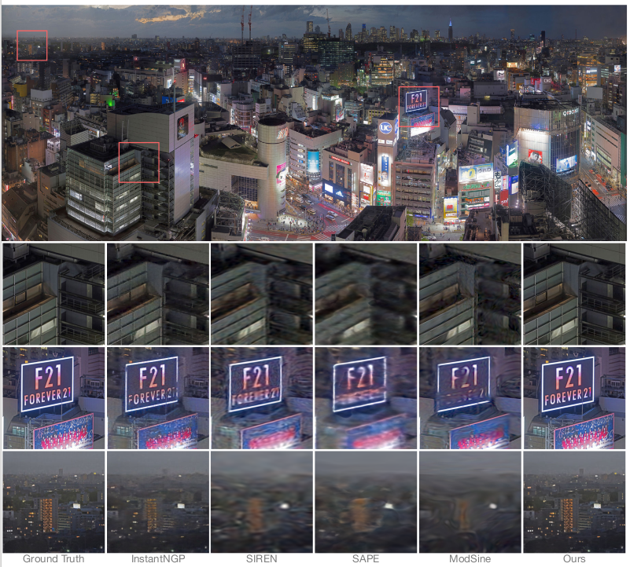

# Neural Fourier Filter Bank


This repository contains the code (in [PyTorch Lightning](https://www.pytorchlightning.ai/index.html)) for the paper:

[__Neural Fourier Filter Bank__](https://arxiv.org/abs/2212.01735)
<br>
[Zhijie Wu](https://zhijiew94.github.io/), [Yuhe Jin](https://scholar.google.ca/citations?user=oAYi1YQAAAAJ&hl=en), [Kwang Moo Yi](https://www.cs.ubc.ca/~kmyi/)
<br>
CVPR 2023


## Introduction

In this project, we propose to learn a neural field by decomposing the signal both spatially and frequency-wise.
We follow the grid-based paradigm for spatial decomposition, but unlike existing work, encourage specific frequencies to be stored in each grid via Fourier feature encodings.
We then apply a multi-layer perceptron with sine activations, taking these Fourier encoded features in at appropriate layers so that higher-frequency components are accumulated on top of lower-frequency components sequentially, which we sum up to form the final output.
We do the evaluations in the tasks of 2D image fitting, 3D shape reconstruction, and neural radiance fields.
All results are tested upon an Nvidia RTX 3090. 

If you have any questions, please feel free to contact Zhijie Wu (wzj.micker@gmail.com).


## Key Requirements
- Python 3.8
- CUDA 11.6
- [PyTorch 1.12.0](https://www.tensorflow.org/)
- [PyTorch Lightning](https://www.pytorchlightning.ai/index.html)
- [torch-scatter](https://github.com/rusty1s/pytorch_scatter#installation)
- [apex](https://github.com/NVIDIA/apex#linux)
- [tiny-cuda-nn](https://github.com/NVlabs/tiny-cuda-nn#pytorch-extension)
- Install requirements by `pip install -r requirements.txt`

> Note: Our current implementations are heavily based on the [ngp-pl](https://github.com/kwea123/ngp_pl) repo. 
> For further details, please also refer to their codebase.


## Novel View Synthesis


A quickstart:
```bash
python train_nerf.py --root_dir <path/to/lego> --exp_name Lego --num_epochs 30 --lr 2e-2 --eval_lpips --no_save_test
```
It will train the Lego scene for 30k steps. `--no_save_test` is to disable saving synthesized images.

More options can be found in `opt.py` and `FFB_config.json` under the `config` folder.

To compute the metrics for the eight Blender scenes, please run the script `benchmark_synthetic_nerf.sh` under the folder `benchmarking`.


## 2D Image Fitting


```bash
python train_img.py --config <path/to/config.json> --input_path <path/to/image>
```

Currently, the model is trained for 50k iterations. But our experiences show that the model has already achieved comparable results near 20k iterations' training.


## 3D Shape Fitting


```bash
python train_sdf.py --config <path/to/config.json> --input_path <path/to/shape>
```

Similar to **2D Image Fitting**, the model is trained with 50k iterations to achieve improved geometric details. However, using `size=100` instead of `size=1000` in the train_dataset (`train_sdf.py`) would slightly reduce the output quality while significantly accelerating the training process.

## Citation and License

```
@InProceedings{Wu_2023_CVPR,
    author    = {Wu, Zhijie and Jin, Yuhe and Yi, Kwang Moo},
    title     = {Neural Fourier Filter Bank},
    booktitle = {Proceedings of the IEEE/CVF Conference on Computer Vision and Pattern Recognition (CVPR)},
    month     = {June},
    year      = {2023},
    pages     = {14153-14163}
}
```

Our codebase is under the MIT License.


## TODO

- [ ] Finish the CUDA version

